# Palette converter

A simply CLI utility to convert an image's color palette to that of another image. The source code can be found in the `src/color_convert.py` file. To run the utility, run this file as a python script with three arguments: first, the name of the file to convert, second, the name of the file to use as a reference for color palette information, and third, the name of the file to write the results to. In addition, the option `-gray` can be added after these three arguments to optionally convert the image to grayscale before color palette conversion (more information in the Algorithm section of this document).

## Example images
Example images can be found in the `example_images` directory, with execution outputs in the `example_output` directory. Credits are given in the following subsection.

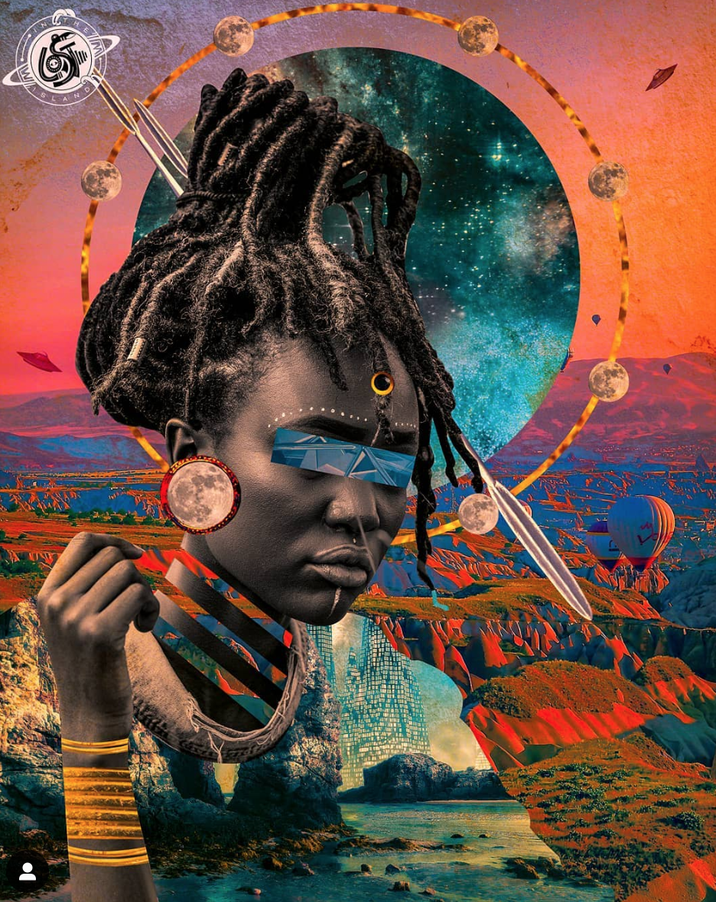 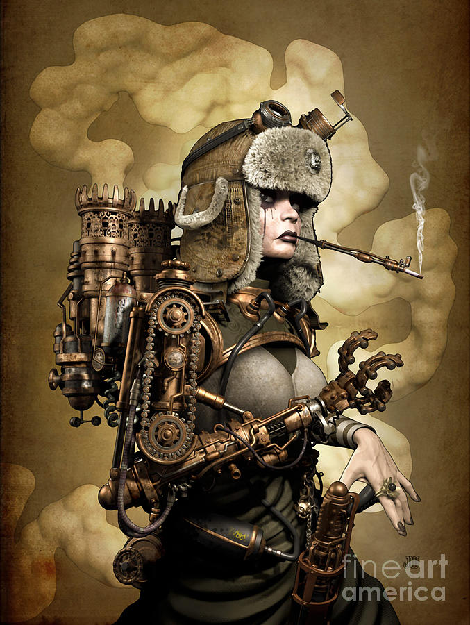 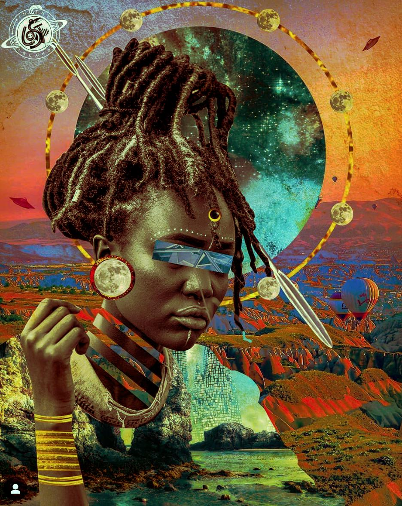

  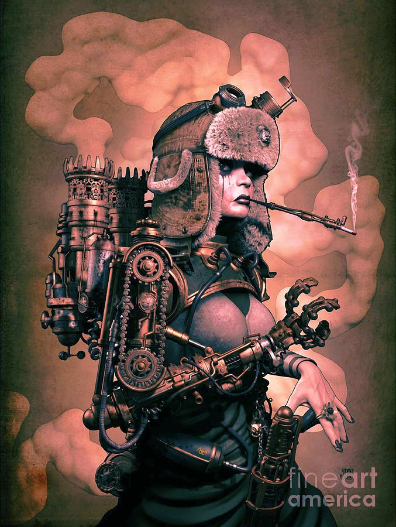

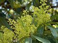 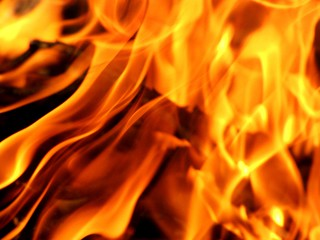 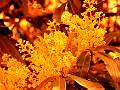

  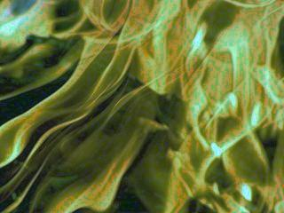

### Example image credits

## Dependencies
This utility depends on Python 3.0+, as well as the following Python software packages:
- `numpy`
- `scipy`
- `Pillow` (`PIL`)

## Algorithm

### Basic description
This utility uses a relatively simple algorithm for color palette conversion. First, it splits both the object and reference image into three seperate bands containing information on red, green, and blue color presence in each image's pixels. Then, using this information, it constructs a color mapping for each individual band based on percentages. That is, if a pixel red value 30 (on a 0-255 scale) is at the 50th percentile for an object image, and the 50th percentile red value for the reference image is 130, then the red mapping for 30 in the object image is 130. This means that all pixels in the object image with a red value of 30 will have a new red value of 130 in the output image. This is repeated across all three bands to create a color mapping, which is then applied to the object image to create the final output.

### Grayscale conversion
There is an option to convert the image to grayscale before applying the mapping to it. The construction of the mapping is the same, but the application will only happen after an image is first converted to grayscale. This option can be activated by adding an optional `-gray` option to the end of the execution command. Using this command tends to make the result more extreme and loses much of the color information of the original image, which is better if you're looking to completely convert color information rather than convert it by a small amount. An example of the difference is given below.

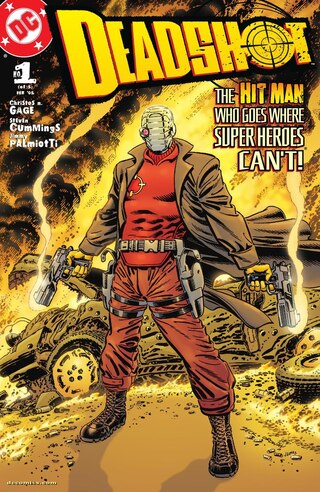 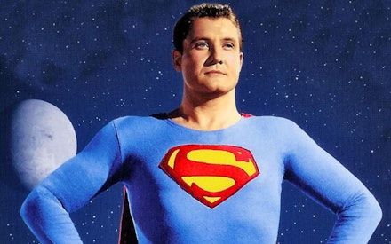 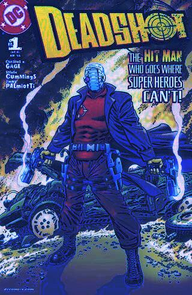

  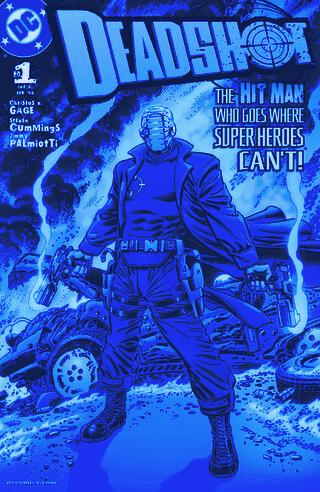

## Project information
This project was started by [Nicolas Antonio Cloutier](mailto:nicocloutier1@gmail.com) in 2024. There are no additional contributors as of yet. If you have suggestions, issues, or additions, feel free to open an issue or pull request on the [GitHub page](https://github.com/NicoACloutier/arxiv_ret). This project operates under the MIT license. Licensing information can be found in the file entitled `LICENSE` in this project's top-level directory.